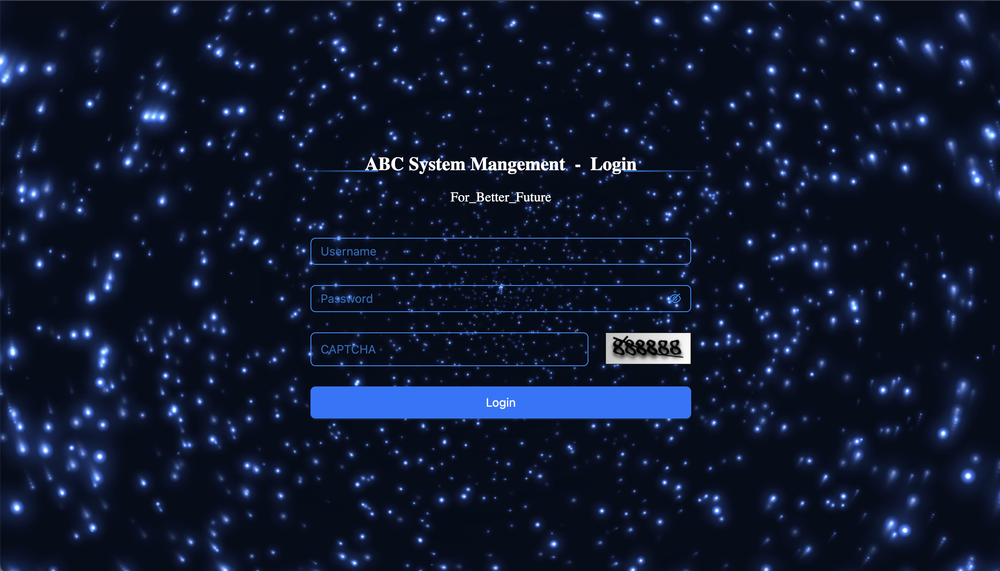
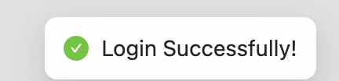
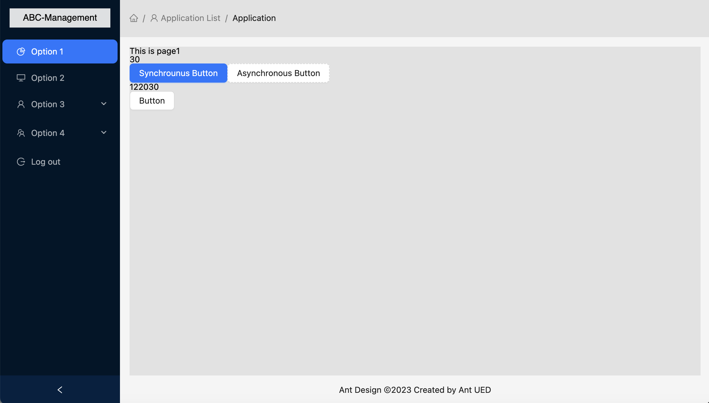
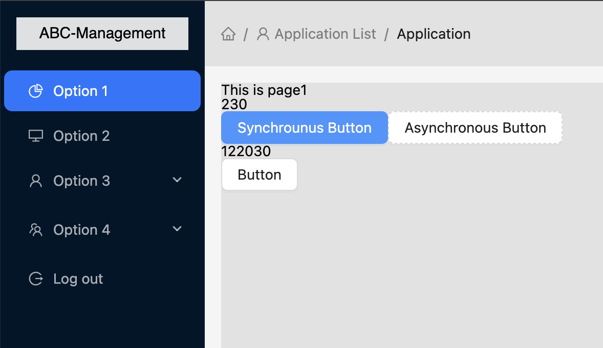
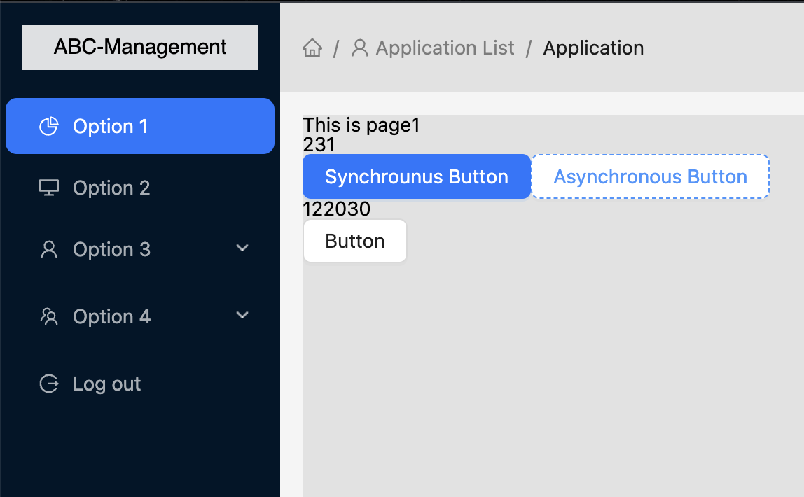
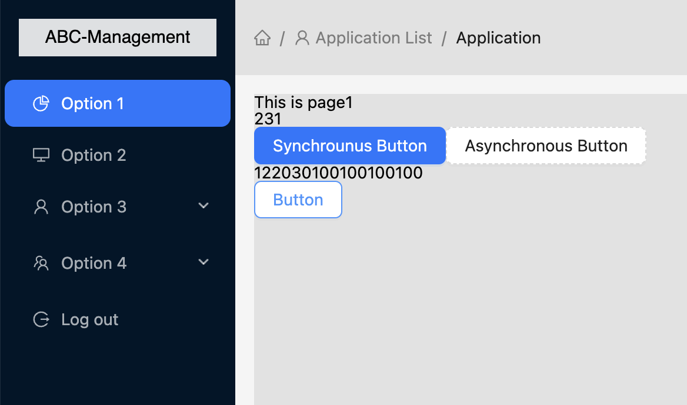

## About The Project
ABC-system-management is Content_Management_System(CMS) which was created for general use. By log in the account given, the user can access the the page and operate their data. It is developed by React18 and Ant-Design UI Framework. 
### Runtime Environment:
    "@ant-design/icons": "^5.0.1",
    "antd": "^5.1.4",
    "axios": "^1.2.3",
    "react": "^18.2.0",
    "react-dom": "^18.2.0",
    "react-redux": "^7.2.8",
    "react-router-dom": "^6.3.0",
    "redux": "^4.1.2",
    "redux-thunk": "^2.4.2",
    "reset-css": "^5.0.1"

## Development Process Brief - Getting Start
### Install sass & reset-css 
	npm i --save-dev sass
	//using 'sass' for global style control, avoid unecessary imports  
	npm i reset-css
	//'reset-css' allows remove default style
### Setup Path Intellisense for VSC
- Add setting in vite.config.ts
```sh
import path from "path"
// https://vitejs.dev/config/
export default defineConfig({
    plugins: [react()],
      resolve:{
          alias:{
      	    "@":path.resolve(__dirname,'./src')
	} 
    }
})
```
- Install declare setting
```sh 
npm i -D @types/node
```
- Add setting in tsconfig.json
```sh
"compilerOptions": {
    ...
    "baseUrl": "./",
    "paths": {
      "@/*": [
        "src/*"
] }
},
```
### Install Ant-Design Framework Support
	npm install antd --save
	//install Ant-Design
	npm install --save @ant-design/icons
	//install component icon
	...
### Setup React Router(array)
- Example:
```sh
import Home from "../views/Home"
import About from "../views/About"
// Navigate
import {Navigate} from "react-router-dom"
const routes = [
    {
path:"/", //redirect
        element:<Navigate  to="/home" />,
    },
    {
        path:"/home",
        element:<Home/>,
    },
    {
        path:"/about",
        element:<About/>,
    }
    // { path: "*", element: <Navigate  to="/" /> },
]
export default routes
```
## Development Process Brief - Basic Functions
#### Login Page


- Given account
```sh
Account: tdtest1
Password:123456
Captcha:888888
----------------
Login the page with this account, message would print if login successful.
```


```sh
If the user try to edit the path for going back login page, message also print:
```


*Thank for the incredible design of canvas UI from 'LEGE'*

#### Main Page:


- Function 1(Synchronous):


```sh
synchronously add number with function 'onClick'
```
- Function 2(Asynchronous):


```sh
asynchronously add number with function 'onClick', the result displays after 1000ms
```
- Function 3(+100 array):


```sh
add val=100 to the array
```


<!-- MARKDOWN LINKS & IMAGES -->
<!-- https://www.markdownguide.org/basic-syntax/#reference-style-links -->
[product-screenshot]: images/screenshot.png
